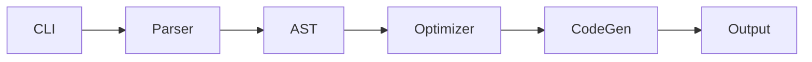

# 反向工程别人的代码

> "Talk is cheap. Show me the code." —— Linus Torvalds

写代码的能力上限，不取决于你看了多少教程，而取决于你**读过多少高质量的代码**。教程只会教你"正确写法"，源码会让你看到"真实写法"——包括那些为了性能、为了兼容、为了团队协作而做的丑陋但必要的妥协。这一章教你怎么把开源项目当老师。

---

## 一、为什么读源码是最快的进步路径

| 读源码 | 看教程 |
|---|---|
| 真实工程问题 | 玩具问题 |
| 模块化、错误处理、测试 | 单文件、happy path |
| 强迫你查文档、查 issue | 被动接收 |
| 看见架构演进的痕迹 | 看一个静态切片 |
| 学到命名、注释、PR 规范 | 学不到协作 |

**经验法则**：你写过的代码 / 你读过的代码 应该在 1:5 到 1:10 之间。

---

## 二、选哪种项目读

新手最容易踩的坑：**第一次读源码就挑 React、Linux、TensorFlow**——结果是放弃。

**理想第一个源码项目的标准：**

- ✅ **代码量 < 5000 行**（核心逻辑能在一周内通读）
- ✅ **GitHub > 100 star**（说明经过社区检验）
- ✅ **最近 6 个月有 commit**（在维护中）
- ✅ **有 README + 几个例子**（不是从零猜功能）
- ✅ **你用过这个工具**（带着"它怎么实现的"好奇心）
- ❌ 避免框架巨兽（React/Vue/Django）
- ❌ 避免 C/C++ 偏底层项目（除非这就是你的方向）

---

## 三、7 步法读任何开源项目

### Step 1: 读 README 和文档

10-30 分钟。回答 3 个问题：

- 它解决什么问题？
- 它的核心 API 长什么样？
- 它和最像的竞品差在哪？

把答案写到 `项目笔记/项目名-阅读笔记.md` 顶部。

### Step 2: 跑通 demo / 测试

**亲手跑起来再读代码**，否则你读的是死字。

```bash
git clone <repo>
cd <repo>
# 按 README 装依赖
npm install   # 或 pip install -e .
# 跑测试
npm test      # 或 pytest
# 跑 example
node examples/basic.js
```

跑不起来？这本身就是第一次实战——查 issue、查 PR，记下解决过程。

### Step 3: 看 package.json / pyproject.toml

知道作者站在哪些巨人肩膀上：

```bash
# JS
cat package.json | jq '.dependencies'
# Python
cat pyproject.toml | grep -A 20 dependencies
```

每个不认识的依赖花 30 秒看一下 README，建立"工具地图"。

### Step 4: 找 entry point

- JS：`package.json` 的 `"main"` / `"exports"` 字段
- Python：`pyproject.toml` 的 `[project.scripts]` 或 `__init__.py`
- Go：`main.go` 或 `cmd/<name>/main.go`
- CLI 工具：`bin/` 目录

从入口往下追，是"流读"的起点。

### Step 5: 画依赖关系图

用 Excalidraw 或 Mermaid，画出主要模块之间的调用关系。**画图是被动阅读的强力解药**——你画不出来就是没读懂。



### Step 6: 选一个最小功能流跟下去

不要试图读完所有代码——**没人这么读**。挑一个具体功能，比如：

- 在 hono 里跟 "处理一个 GET /hello 请求" 全过程
- 在 zustand 里跟 "调用 setState 后组件如何重渲染"
- 在 datasette 里跟 "用户访问 /db/table 看到表格数据"

从用户行为开始，一步步追到底层。**这是工业读法的精髓**——按"用户故事"切片读。

### Step 7: 加中文注释 + 写一篇博客

最后一步是"教"：

1. fork 项目，建一个 `notes-zh/` 分支。
2. 在关键函数加中文注释（不污染原代码可放在副本里）。
3. 写一篇 3000-5000 字博客：项目定位 → 架构图 → 一个完整请求流 → 学到什么。
4. 发出去。

**写博客是终极测试**——写不出来说明没读懂。

---

## 四、用 IDE 读源码的技巧

| 操作 | VS Code 快捷键 | 用途 |
|---|---|---|
| Go to Definition | `F12` / `Cmd+Click` | 跳到函数定义 |
| Peek Definition | `Alt+F12` | 不跳转，弹窗预览 |
| Find All References | `Shift+F12` | 看一个符号被谁用 |
| Go Back | `Ctrl+-` | 跳回上一个位置 |
| Symbol in Workspace | `Cmd+T` | 全工程搜符号 |
| Symbol in File | `Cmd+Shift+O` | 当前文件大纲 |
| Bracket Match | `Ctrl+Shift+\` | 跳到匹配括号 |

**必装插件：**

- **GitLens**：每行代码旁显示最后修改人 + commit message + 时间。读到诡异代码就 `git blame`，常常发现是修复某个 issue。
- **Error Lens**：错误内联显示。
- **Better Comments**：让你的中文注释更醒目。

---

## 五、用工具量化项目

```bash
# 装 cloc
brew install cloc
cloc <repo>            # 按语言统计代码量

# 找最大的文件
find . -name "*.ts" | xargs wc -l | sort -rn | head -20

# 看项目历史
git log --oneline | wc -l            # commit 总数
git shortlog -sn | head -10           # 贡献者排名
git log --since="6 months ago" --oneline | wc -l   # 最近活跃度
```

**git log 看演进**：找一个核心文件，看它的历史：

```bash
git log -p --follow src/core/index.ts | less
```

你会看到这个文件 3 年来怎么从 50 行长到 800 行——**这是最好的架构演进教材**。

---

## 六、分模块读 vs 流读

| 流读（推荐入门） | 模块读（推荐第二遍） |
|---|---|
| 沿一个用户故事追到底 | 一次只读一个目录 |
| 看到点而非面 | 看到面而非点 |
| 适合搞懂"它怎么工作" | 适合搞懂"它怎么组织" |

**第一次流读，第二次模块读**——两遍下来项目基本通透。

---

## 七、看 PR 学协作 / 看 Issue 学痛点

GitHub 不只是代码托管，是**完整的工程教科书**。

### 7.1 找标星 PR

```
https://github.com/<owner>/<repo>/pulls?q=is:pr+sort:reactions-+1
```

按 reaction 排序，能看到社区最认可的 PR。读 PR 比读 commit 高维——你能看到：

- **PR 描述**：作者怎么解释这个改动（学技术写作）
- **Review 评论**：维护者怎么挑刺（学代码 review）
- **多次提交**：作者怎么响应 review 改代码（学迭代）

### 7.2 看 Top Issue

按 👍 排序找痛点 issue：

```
https://github.com/<owner>/<repo>/issues?q=is:issue+sort:reactions-+1
```

这告诉你**用户最想要什么 / 最痛苦什么**，是产品思维训练。

---

## 八、标注阅读法

读源码不是看小说，要做痕迹：

1. **comment 源码**：fork 后在关键处加 `// [me] 这里是 xxx 的核心`。
2. **折叠无关代码**：VS Code 区域折叠 (`#region` / `Cmd+K Cmd+0`)，让屏幕上只剩主线。
3. **高亮关键函数**：用 `Bookmarks` 插件给关键行打书签，可在多处跳转。
4. **画"侦探板"**：Excalidraw 上贴函数截图、画箭头，模拟侦探破案的墙。

---

## 九、推荐 5 个适合"第一次读"的项目（按难度递增）

### 1. karpathy/micrograd（150 行，⭐⭐）

> Andrej Karpathy 用 150 行 Python 实现了一个能跑反向传播的微型框架。

读完你会理解 PyTorch 的 autograd 在干什么。配套有作者亲讲的视频。**没有比它更适合作为第一个源码项目的了。**

### 2. pmndrs/zustand（约 1k 行，⭐⭐⭐）

> 极简的 React 状态管理库，比 Redux 简单一个数量级。

适合学 React 的人，能看到"hooks + 订阅模式"的优雅实现。

### 3. honojs/hono（中型，⭐⭐⭐）

> 跑在 Edge / Bun / Deno / Node 的超快 Web 框架。

适合学过 Express 的人，看现代 Web 框架怎么写——TypeScript 类型体操、Trie 路由、中间件流式组合。

### 4. encode/starlette（中型，⭐⭐⭐⭐）

> FastAPI 的底层 ASGI 框架，作者也是 Django REST Framework 的 Tom Christie。

读完会理解 FastAPI 的 "魔法" 是怎么变出来的，对 Python async / 协议层有质的飞跃。

### 5. simonw/datasette（中型偏大，⭐⭐⭐⭐）

> Simon Willison（Django 联合创建者）的个人项目：把任何 SQLite 一键变成可探索的 Web 应用。

适合作为"目标项目"——独立开发者代码组织、插件系统、文档写作的全方位教材。可以一直读半年。

---

## 十、推荐工具

- **[sourcegraph.com](https://sourcegraph.com)**：浏览器里全功能阅读 GitHub 代码（跳转、引用、跨仓库搜索）。
- **GitHub Copilot Chat**：选中一段代码 → "解释这段代码"，AI 当陪读。
- **Cursor**：把整个项目当作 context 提问 "这个项目是怎么处理鉴权的？"
- **[gitingest.com](https://gitingest.com)**：把整个 repo 打包成单文件文本，扔给 LLM。
- **DeepWiki**：自动给 GitHub 项目生成 wiki，先看 wiki 再读源码。

---

## 十一、本月实战

挑战：**精读 1 个 1000-3000 行项目，输出 5000 字阅读笔记**。

里程碑：

- 第 1 周：选项目 + 跑通 demo + 画整体架构图
- 第 2 周：跟 1 个最小功能流到底，做注释
- 第 3 周：再跟 1 个功能流，对比异同
- 第 4 周：写 5000 字博客发出去

**完成后的副作用**：你会发现自己写代码时开始有"组织感"——知道怎么分文件、怎么命名、什么时候抽象。这是教程教不出来的。

---

## 模板：源码阅读笔记 (source-reading-template.md)

```markdown
---
title: 源码阅读 - <项目名>
tags: [type/source-reading, topic/xxx]
项目地址:
代码量:
star 数:
阅读开始: 
阅读结束: 
---

# 一、定位（README 提炼）
- 解决什么问题：
- 核心 API：
- 主要竞品对比：

# 二、架构图
![[arch.excalidraw]]

# 三、目录结构
- src/
  - core/   # 
  - utils/  # 

# 四、最小功能流跟读
## 用户故事：xxx
1. 入口在 xxx.ts 第 N 行
2. ...

# 五、亮点设计
- 

# 六、可商榷的地方
- 

# 七、我学到了什么 / 偷了什么
- 
```

---

## 下一步

- → [[../09-综合实战-毕业项目/06-真实毕业项目案例库]]：把读源码的能力用到选项目上。
- → [[../09-综合实战-毕业项目/07-GitHub项目精选-灵感库]]：直接 fork 起步的项目库。
