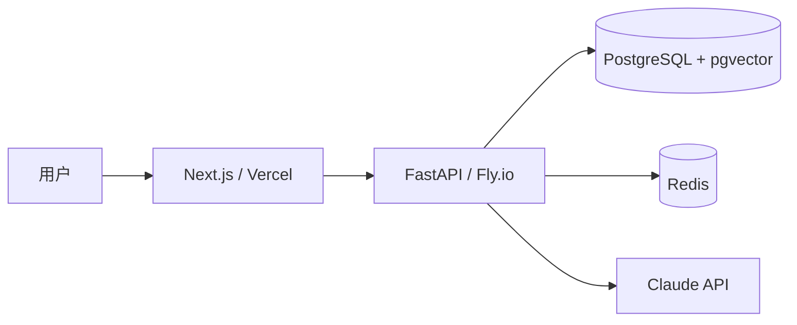

# 架构设计与技术选型

> "在键盘上花 1 小时画图，能在后面省下 30 小时返工。"

很多独立开发者的项目死在第 4 周——不是因为做不出，是因为做到一半发现架构错了，重写代价比从零更高。本章教你写一份"挡箭牌级"的 RFC，让你后面 6 周心里有底。

## 一、为什么先设计架构

### 不设计的代价

- **第 3 周才想起加鉴权**：所有 API 都得改
- **数据库忘了加索引**：上线第二天 RDS CPU 100%
- **前后端没约定 API 字段**：联调三天三夜
- **AI 调用没限流**：一夜之间 OpenAI 账单 $300

### 设计的核心目标

不是为了"看起来专业"，而是回答 6 个问题：

1. 用户的请求是怎么从浏览器到达数据库再回来的？
2. 数据怎么存？为什么这么存？
3. 哪些是性能瓶颈？最坏情况会怎样？
4. 钱花在哪？月成本上限多少？
5. 出 bug 怎么发现？怎么修？
6. 半年后想加 X 功能，现在的架构够用吗？

## 二、架构图三视图

一张图说不清，要画三张：

### 视图 1：系统架构图（高层 - 给所有人看）

```
┌──────────┐         ┌─────────────┐
│  浏览器  │ ──HTTPS─▶│   Vercel    │  Next.js 15 (RSC + Client)
└──────────┘         └──────┬──────┘
                            │ API
                     ┌──────▼──────┐
                     │   Fly.io    │  FastAPI + Uvicorn
                     │   (后端)    │
                     └──┬───┬───┬──┘
        ┌───────────────┘   │   └────────────┐
        ▼                   ▼                ▼
  ┌──────────┐       ┌──────────┐     ┌─────────────┐
  │ Supabase │       │  Redis   │     │  Anthropic  │
  │ (PG+pgv) │       │(Upstash) │     │  Claude API │
  └──────────┘       └──────────┘     └─────────────┘
        │                                    │
        └────────────► Sentry / Langfuse / PostHog
```

工具：**Excalidraw**（推荐）或 **Mermaid**（写代码画图）。

Mermaid 示例：


### 视图 2：数据流图（功能视角）

以"用户提问 PDF"为例：

```
1. 用户输入问题 (前端)
       ▼
2. 前端 POST /api/chat (含 doc_id, question)
       ▼
3. 后端鉴权（JWT 验证）
       ▼
4. 检查用户额度（Redis 计数）
       ▼
5. embedding(question) → 1536 维向量
       ▼
6. pgvector 检索 top-5 chunks
       ▼
7. 组装 prompt：question + chunks + 历史
       ▼
8. 调用 Claude (流式)
       ▼
9. 边返回边写 DB（messages 表）
       ▼
10. 前端 SSE 流式渲染
```

每个箭头都要回答："失败了怎么办？" 比如第 8 步 Claude 超时——降级到 Haiku？还是返回错误？写在 RFC 里。

### 视图 3：部署拓扑图（运维视角）

包括：
- 域名、CDN、SSL 证书
- 容器/进程数、自动伸缩规则
- 数据库主从、备份策略
- 监控告警链路

## 三、技术选型决策矩阵

每个组件都按这 5 维打分（1-5）：

| 候选 | 成熟度 | 学习曲线 | 社区 | 性能 | 成本 | 总分 |
|------|--------|----------|------|------|------|------|
| Next.js | 5 | 4 | 5 | 4 | 5 | 23 |
| Remix | 4 | 4 | 3 | 4 | 5 | 20 |
| Nuxt | 4 | 3 | 4 | 4 | 5 | 20 |

**学习曲线越高分代表越简单**。

## 四、推荐技术栈（基于本路线）

### 前端
- **Next.js 15**（App Router + RSC）
- **TypeScript**（强类型必须）
- **Tailwind CSS** + **shadcn/ui**（组件库）
- **TanStack Query**（服务端状态）
- **Zustand**（轻量本地状态）
- **next-auth v5**（鉴权）

### 后端
- **FastAPI**（Python 3.12）
- **Pydantic v2**（数据校验）
- **SQLAlchemy 2.0** + **Alembic**（ORM + 迁移）
- **uvicorn + gunicorn**（生产）

### 数据库与缓存
- **PostgreSQL 16**（主库）
- **pgvector**（向量检索，省一个 Pinecone）
- **Redis（Upstash）**（会话/限流/缓存）

### AI 层
- **Claude Sonnet 4**（主模型）
- **Claude Haiku**（降级 + 廉价任务）
- **LangGraph**（多步 Agent）
- **自建 MCP Server**（工具协议）
- **Voyage / OpenAI** embedding

### 部署 & 运维
- **Vercel**（前端 + Edge Function）
- **Fly.io**（后端，全球节点）
- **Supabase**（DB + Auth 备选）
- **Cloudflare R2**（对象存储，比 S3 便宜）

### 监控分析
- **Sentry**（错误）
- **Langfuse**（LLM 追踪）
- **PostHog**（产品分析 + A/B）
- **Better Stack**（uptime + 日志）

## 五、数据库 schema 设计

### 范式 vs 反范式

- **OLTP 为主（用户登录、写入频繁）**：第 3 范式起步。
- **读多写少（仪表盘）**：可以反范式 + 物化视图。
- **AI 应用**：messages 表往往要冗余存 token 数 + cost，方便后期分析。

### 必备字段

每张表都加：
- `id`：UUID v7（带时间戳）或 bigserial
- `created_at` / `updated_at`：默认 now()
- `deleted_at`：软删
- `tenant_id`（如果多租户）

### 索引清单（容易漏的）

- 外键自动加索引
- 高频 WHERE 字段
- (tenant_id, created_at) 复合索引
- pgvector：HNSW 或 IVFFlat（看数据量）

## 六、API 设计先行

**先写 OpenAPI Spec，再写代码。** 让前后端并行开发。

```yaml
# openapi.yaml 片段
paths:
  /api/v1/chat:
    post:
      summary: 与文档对话
      requestBody:
        content:
          application/json:
            schema:
              type: object
              required: [doc_id, question]
              properties:
                doc_id: { type: string, format: uuid }
                question: { type: string, maxLength: 2000 }
                conversation_id: { type: string, format: uuid }
      responses:
        "200":
          description: SSE 流
          content:
            text/event-stream: {}
        "402":
          description: 超额度
        "429":
          description: 限流
```

FastAPI 用 Pydantic 反向生成 OpenAPI；前端用 `openapi-typescript` 生成类型。

## 七、鉴权方案选择

| 方案 | 适用 | 优点 | 缺点 |
|------|------|------|------|
| JWT 自建 | 中小项目 | 无依赖、便宜 | 撤销难 |
| next-auth v5 | Next 全栈 | 集成快 | 强绑定 |
| Clerk | SaaS | UI 漂亮、MFA | $25/月起 |
| Supabase Auth | 数据 + 认证一体 | 免费 | 锁定 |

**推荐**：MVP 用 next-auth + JWT；商业化后迁 Clerk。

## 八、多租户设计

如果做 SaaS，从第一天就考虑：

**三种模式**：
1. **共享数据库 + tenant_id 列**（推荐 MVP）
2. **共享数据库 + 每租户 schema**
3. **每租户独立数据库**（合规要求）

模式 1 的核心：
- 每张业务表 `tenant_id NOT NULL`
- ORM 默认 query 加 `WHERE tenant_id = current_user.tenant_id`
- 用 PostgreSQL Row-Level Security 兜底

## 九、成本预估表

```markdown
## 月成本预估（100 活跃用户，每人日均 20 次提问）

| 项目 | 用量 | 单价 | 月成本 |
|------|------|------|--------|
| Claude Sonnet input | 60M tokens | $3/M | $180 |
| Claude Sonnet output | 15M tokens | $15/M | $225 |
| Embedding (Voyage) | 5M tokens | $0.05/M | $0.25 |
| Vercel Pro | 1 团队 | $20 | $20 |
| Fly.io shared 1x | 2 实例 | $5 | $10 |
| Supabase Pro | DB+Auth | $25 | $25 |
| Upstash Redis | 10K cmd/d | $0 (free) | $0 |
| Sentry Team | 50K event | $26 | $26 |
| **合计** | | | **≈ $486/月** |

每用户成本：$4.86
最低定价：$9.99/月（毛利 50%）
```

## 十、安全检查清单

- [ ] 所有 API 走 HTTPS
- [ ] CORS 白名单
- [ ] SQL 注入防护（ORM 参数化）
- [ ] XSS（前端 React 默认转义）
- [ ] CSRF（next-auth 自带）
- [ ] 限流（Redis + slowapi）
- [ ] LLM Prompt 注入防御
- [ ] 用户上传文件类型/大小校验
- [ ] 敏感数据加密（PII 字段 AES）
- [ ] 密钥不进 git（用 Vault / 1Password CLI）
- [ ] 日志脱敏（不记完整 token）
- [ ] 备份每日自动 + 异地

## 十一、RFC 模板

```markdown
# AskMyDocs RFC v0.1
作者：YOU  日期：2026-06-19  状态：草案

## 1. 背景与目标
（链接 PRD）

## 2. 非目标
列出本次明确不做的事。

## 3. 高层架构
（贴系统架构图）

## 4. 数据模型
（贴 ER 图 + DDL）

## 5. API 设计
（贴 OpenAPI 关键端点）

## 6. 关键流程
（贴数据流图，逐步说明）

## 7. 技术选型理由
（决策矩阵 + 备选方案）

## 8. 性能预估
- p99 延迟目标 < 3s
- 单实例 QPS 50

## 9. 成本估算
（贴成本表）

## 10. 安全
（贴安全清单）

## 11. 风险与备选
- 如果 Claude 涨价 50%：方案 B 切换到 GPT-4.1
- 如果 pgvector 撑不住 100 万向量：迁 Pinecone

## 12. 里程碑
- W1: 脚手架 + 鉴权
- W2: 后端核心
- ...
```

## 十二、本章实战清单

- [ ] 用 Excalidraw 画三视图架构图
- [ ] 完成技术选型决策矩阵（至少 3 个组件）
- [ ] 写出 ER 图 + Alembic 初始迁移
- [ ] OpenAPI Spec 至少 5 个端点
- [ ] 完成成本预估表
- [ ] 完成安全清单 review
- [ ] 写完 RFC，找 1 位有经验的朋友 review

## 十三、案例：架构 review 救了一个项目

学员小 W 做"AI 法律咨询"。RFC review 时被指出：
- 漏了**对话审计日志**（合规必需）
- pgvector 在 50 万 chunks 时召回慢
- Claude 直接回法律建议有责任风险

调整：加审计表 + 切 Pinecone + 在 system prompt 强制"非法律意见免责声明"。

如果是上线后才发现这些问题，重写要 2 周。RFC 阶段改，2 小时。

---
**上一篇 ←** [[01-选题与产品设计]]
**下一篇 →** [[03-MVP开发流程]]
