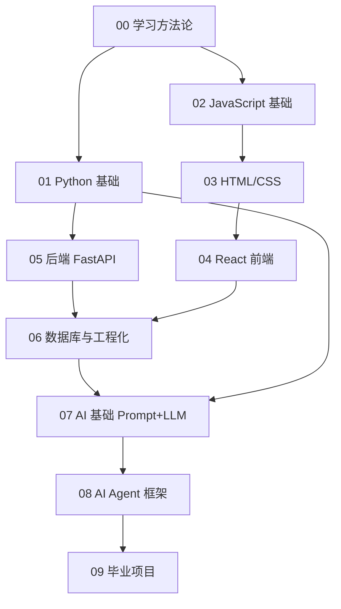

# 🚀 全栈 + AI Agent 源码级学习路线

> **目标**：从零基础起步，最终能独立设计并实现生产级 AI Agent 全栈应用，并对 Python、JavaScript、React、LLM 等核心技术达到**源码级理解**。

## 🎯 学习哲学（先读）

1. **不要速成**：源码级精通没有捷径。你需要在"理解 → 模仿 → 重写 → 教会别人"四个阶段反复循环。
2. **项目驱动**：每章配 1 个完整项目作为验收标准，没做完项目不算学完该章。
3. **费曼学习法**：每学完一节，**在本仓库写一篇笔记教会别人**（用你自己的话）。
4. **造轮子精神**：到了源码阶段，必须亲手实现 mini 版（mini-react / mini-vue / mini-langchain）。
5. **公开学习**：把代码 push 到 GitHub，把笔记发到博客/掘金/小红书，建立反馈回路。

详见 [[00-学习方法论/00-如何高效学习编程]]

## 🗺️ 路线图（按依赖顺序）

## 📚 章节索引

| # | 模块 | 周期 | 章节项目 | 状态 |
|---|------|------|----------|------|
| 00 | [[00-学习方法论/00-如何高效学习编程\|学习方法论]] | 1 周 | 写一份你的"学习契约" | ⬜ |
| 01 | [[01-Python-从零到源码/01-Python总纲\|Python 从零到源码]] | 10 周 | 命令行工具 + 爬虫 + CPython 阅读 | ⬜ |
| 02 | [[02-JavaScript-从零到源码/02-JavaScript总纲\|JavaScript 从零到源码]] | 10 周 | 手写 Promise / 实现 mini-lodash | ⬜ |
| 03 | [[03-HTML-CSS-现代Web/03-HTML-CSS总纲\|HTML/CSS 现代 Web]] | 4 周 | 像素级还原 3 个真实网站 | ⬜ |
| 04 | [[04-前端框架-React/04-React总纲\|React 从使用到源码]] | 10 周 | 在线协作白板 + 手写 mini-react | ⬜ |
| 05 | [[05-后端开发-FastAPI-Node/05-后端总纲\|FastAPI + Node 后端]] | 8 周 | 完整 RESTful API + JWT + 测试 | ⬜ |
| 06 | [[06-数据库与工程化/06-数据库工程化总纲\|数据库 + 工程化]] | 6 周 | PostgreSQL + Redis + Docker 部署 | ⬜ |
| 07 | [[07-AI基础-Prompt与LLM/07-AI基础总纲\|AI 基础：Prompt + LLM]] | 6 周 | 从零实现 GPT (rasbt 课) | ⬜ |
| 08 | [[08-AI-Agent-框架与源码/08-Agent总纲\|AI Agent 框架与源码]] | 12 周 | 多 Agent 协作系统 + MCP server | ⬜ |
| 09 | [[09-综合实战-毕业项目/09-毕业项目总纲\|毕业项目]] | 8-12 周 | 一个能上线、能赚钱、能写进简历的产品 | ⬜ |

## 🛠️ 工具栈（先备齐）

| 类型 | 工具 | 备注 |
|------|------|------|
| 编辑器 | VS Code / Cursor | 必装：Python、ESLint、Prettier、GitLens |
| 终端 | iTerm2 + Oh My Zsh | macOS；Windows 用 Windows Terminal + WSL2 |
| 版本控制 | Git + GitHub | 必学，第 0 周就要会 |
| Python | uv 或 pyenv + poetry | uv 是 2025 后新标准 |
| Node.js | nvm + pnpm | pnpm 比 npm 快很多 |
| 容器 | Docker Desktop | 第 06 章用到 |
| AI 助手 | Claude / Cursor | 学习而非依赖，详见学习方法论 |
| 笔记 | Obsidian（这里！） | 边学边写笔记 |

## 📖 资源总库

详见 [[_资源库/资源总览]]

**必读 Top 10**（按学习顺序）：
1. [MDN Web 文档（中文）](https://developer.mozilla.org/zh-CN/)
2. [廖雪峰 Python 教程](https://liaoxuefeng.com/books/python/)
3. [现代 JavaScript 教程](https://zh.javascript.info/)
4. [阮一峰 ES6 入门](https://es6.ruanyifeng.com/)
5. 《Fluent Python (2nd)》
6. [You Don't Know JS Yet](https://github.com/getify/You-Dont-Know-JS)
7. [React 中文文档](https://zh-hans.react.dev/) + [React 技术揭秘（卡颂）](https://react.iamkasong.com/)
8. [FastAPI 中文文档](https://fastapi.tiangolo.com/zh/)
9. [Anthropic Docs](https://docs.anthropic.com/) + [Cookbook](https://github.com/anthropics/anthropic-cookbook)
10. [build-your-own-x](https://github.com/codecrafters-io/build-your-own-x)

## ✅ 进度追踪

每周日晚在 [[_我的进度追踪/周报模板]] 写一份周报，强制复盘。

每完成一个章节项目，在 [[_我的进度追踪/项目里程碑]] 打卡。

## 🔥 下一步

→ 打开 [[00-学习方法论/00-如何高效学习编程]] 开始第 0 周。
