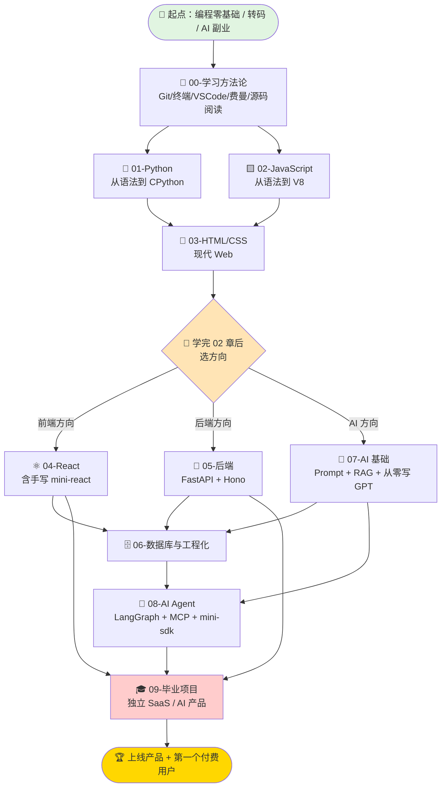

# 学习路线全景图

> "Slow is smooth, smooth is fast." 慢就是稳，稳就是快。

这是整个 vault 的**总指挥部**。10 个章节、90+ 文件、12-18 个月的旅程，全部在这一张图里。每次迷路了，回到这一页。

---

## 一、总览图（Mermaid）



---

## 二、9 章节依赖关系详图

| 章节 | 前置 | 输出 | 时长 |
|---|---|---|---|
| 00 学习方法论 | 无 | 工具链就绪 | 1 周 |
| 01 Python | 00 | 能写脚本 / 调 LLM API | 8-10 周 |
| 02 JavaScript | 00 | 能写交互页面 | 8-10 周 |
| 03 HTML/CSS | 00（可与 02 并行） | 能做好看的页面 | 4 周 |
| 04 React | 02 + 03 | 能做单页应用 / 全栈 Next.js | 10-12 周 |
| 05 后端 | 01 或 02 | 能写 REST/WS API | 8-10 周 |
| 06 数据库工程化 | 01 + 05 | 能管理数据 + 上 K8s | 6 周 |
| 07 AI 基础 | 01 | 能做 RAG / 评测 / 训练 mini-GPT | 6-8 周 |
| 08 AI Agent | 07 + 05 | 能写 / 读 Agent 框架 | 12 周 |
| 09 毕业项目 | 04/05/08 任一 | 上线一个真实产品 | 6-12 周 |

---

## 三、12-18 个月时间轴

### 阶段一：地基（M1-M3）

| 月 | 主线 | 副线 | 里程碑 |
|---|---|---|---|
| **M1** | 00 方法论全 | 注册 GitHub / Twitter / 博客 | 提交第一个 PR |
| **M2** | 01 Python W01-W04 | 每周 1 张 Atomic Note | 写 5 个 CLI 小脚本 |
| **M3** | 01 Python W05-W10 + 02 JS W01-W02 | 读完 micrograd 源码 | 发布第一个 PyPI 包 |

### 阶段二：栈选型（M4-M6）

| 月 | 主线 | 副线 | 里程碑 |
|---|---|---|---|
| **M4** | 02 JS W03-W08 + 03 HTML/CSS | 复刻 5 个网页 | 个人主页上线 |
| **M5** | 02 JS W09-W10 + 决策点 | 选定方向 | 写"我为什么选 X 方向"博客 |
| **M6** | 04 React W01-W05 / 05 后端 W01-W04 / 07 AI W01-W03 | 部署一个 demo 到 Vercel/Fly | 第一个全栈小项目 |

### 阶段三：深度（M7-M10）

| 月 | 主线 | 副线 | 里程碑 |
|---|---|---|---|
| **M7** | 04 W06-W10 / 05 W05-W08 | 06 数据库 W01-W03 | 接入 PostgreSQL + Redis |
| **M8** | 06 W04-W06 + 07 RAG | 读 datasette / hono 源码 | 个人 RAG 上线 |
| **M9** | 07 W04-W06 (从零 GPT) | 08 W01-W02 (mini-agent) | 训练并发布一个微型模型 |
| **M10** | 08 W03-W08 (LangGraph + MCP) | 写一个 MCP server | 在 GitHub 公开你的 MCP |

### 阶段四：毕业（M11-M15）

| 月 | 主线 | 副线 | 里程碑 |
|---|---|---|---|
| **M11** | 08 W09-W12 | 09 选题 | 锁定毕业项目 idea |
| **M12** | 09-01 ~ 09-03 MVP | 找 5 个种子用户 | MVP 跑通主流程 |
| **M13** | 09-04 发布 | 上 ProductHunt / HN | 100 个用户 |
| **M14** | 09-05 商业化 | 接 Stripe | 第一个付费用户 |
| **M15** | 持续迭代 | 写复盘博客 | $1000 MRR 或转正 Offer |

### 阶段五（可选）：扩张（M16-M18）

| 月 | 主线 | 里程碑 |
|---|---|---|
| **M16** | 第二个产品 / 接外包 | 副业稳定 |
| **M17** | 深耕一个开源项目 | 成为某项目 Maintainer |
| **M18** | 写书 / 做课 / 全职独立 | 选择下一个 5 年 |

---

## 四、关键决策点

### 🔀 决策点 1：M5 末（学完 02 章后）

> "前端 vs 后端 vs AI——我该选哪个？"

| 你的画像 | 推荐方向 |
|---|---|
| 喜欢视觉、做产品、看立刻能展示的东西 | 04 前端 React |
| 喜欢系统、性能、架构、不爱画 UI | 05 后端 FastAPI/Hono |
| 已工作但想转 AI、对模型 / agent 感兴趣 | 07 AI 基础 |
| 还不确定 | 4 周分别尝试一周，写 4 篇日记，然后决定 |

**决策原则**：选你**最有耐心做 10000 小时**的那个，不是最热门的。

### 🔀 决策点 2：M10 末（学完 07 章后）

> "做产品 vs 做开源 vs 找工作？"

| 选项 | 适合 | 风险 |
|---|---|---|
| 做产品（继续到 09） | 想要被动收入 / 自主 | 6-12 月可能没收入 |
| 做开源出名 | 想长期建立名声 | 短期不变现 |
| 找工作 | 现金流压力大 | 时间被绑定 |

**经验**：年龄 < 30 选产品；现金流 < 6 个月生活费 选工作；想纯输出选开源。**三者可以混合**。

### 🔀 决策点 3：M13 上线后

> "继续这个产品 vs 转下一个 idea？"

判断标准：

- 用户**自然增长**（无投流）→ 继续打磨
- 朋友夸但陌生人不用 → 改产品定位
- 自己用得很爽但想付费的没几个 → 重新选题
- 6 个月 0 增长 → 换 idea

---

## 五、每章节 GitHub 项目精选文件链接

每章配套一个"GitHub 精选"文件，作为该章学习的活教材：

- 00 → [[00-学习方法论/05-GitHub项目精选-入门导航]]
- 01 → [[01-Python-从零到源码/11-GitHub项目精选-Python]]
- 02 → [[02-JavaScript-从零到源码/11-GitHub项目精选-JavaScript]]
- 03 → [[03-HTML-CSS-现代Web/05-GitHub项目精选-CSS与设计]]
- 04 → [[04-前端框架-React/11-GitHub项目精选-React生态]]
- 05 → [[05-后端开发-FastAPI-Node/09-GitHub项目精选-后端实战]]
- 06 → [[06-数据库与工程化/07-GitHub项目精选-数据库DevOps]]
- 07 → [[07-AI基础-Prompt与LLM/07-GitHub项目精选-LLM学习]]
- 09 → [[09-综合实战-毕业项目/07-GitHub项目精选-灵感库]]

---

## 六、每章节核心项目清单

| 章 | 核心交付项目 |
|---|---|
| 01 | CLI 工具（如个人 todo） + 一个 PyPI 包 |
| 02 | 浏览器小游戏 / 工具（如番茄钟） |
| 03 | 个人主页（Tailwind 重写） |
| 04 | mini-react（手写 v1 + v2） + Next.js 全栈 demo |
| 05 | FastAPI + Hono 各一个 RESTful 服务 |
| 06 | 接入 PG + Redis + 向量库的小搜索引擎 |
| 07 | 从零训练一个 mini-GPT + RAG 个人助手 |
| 08 | mini-agent SDK（< 500 行）+ 一个 MCP server |
| 09 | **真正上线的毕业项目（核心）** |

---

## 七、资源总览快速通道

- 📚 **资源大全**：[[_资源库/资源总览]]、[[_资源库/awesome-索引导航大全]]
- 🎯 **快速实战**：[[_资源库/Easy-vibe专题-30分钟跑起来的项目]]
- 🔬 **从零造轮子**：[[_资源库/build-your-own-x-中文跟做指南]]
- 🏗️ **拆解他人 SaaS**：[[_资源库/真实开源SaaS拆解]]
- 💼 **求职 / 简历**：[[_附录-面试与简历/求职准备]]

---

## 八、进度追踪入口

- 📋 **学习契约**（誓约 + KPI）：[[_我的进度追踪/学习契约]]
- 📅 **周报模板**：[[_我的进度追踪/周报模板]]
- 🎯 **项目里程碑**：[[_我的进度追踪/项目里程碑]]

**承诺**：每周日花 30 分钟更新周报。**周报断了 2 周 = 学习要崩**——立刻拉一个朋友互相督促。

---

## 九、"我学到第 X 章了，下一步该做什么"自助查询表

| 你目前在 | 这周做什么 | 下周做什么 | 卡住时怎么办 |
|---|---|---|---|
| 还没开始 | 读完 [[00-学习方法论/00-如何高效学习编程]] + [[06-费曼学习法与笔记系统]] | 配好 [[01-环境配置完全指南]] + 注册 GitHub | 找一个学习伙伴 |
| 01 W01-W03 | 写 3 个 CLI 脚本 | W04 OOP + 第 1 张 Atomic Note | 跟 [[_资源库/Easy-vibe专题-30分钟跑起来的项目]] 抄 |
| 01 W10 | 读 micrograd 源码 | 切到 02 W01 | 写一篇博客复盘 |
| 02 W10 | 决策方向（前端/后端/AI） | 进入 03 或 05 或 07 | 重读"决策点 1" |
| 04 W05 | 用 Next.js 做个小工具上线 | W06 Next.js 进阶 | fork [[../09-综合实战-毕业项目/07-GitHub项目精选-灵感库]] 的模板 |
| 05 W04 | 加上 JWT 鉴权 | W05 切 Hono | 看 [[09-GitHub项目精选-后端实战]] |
| 07 W04 | 跑通 RAG demo | W05 评测 + W06 mini-GPT | 看 Karpathy 的 nanoGPT |
| 08 W06 | 写一个 MCP server | W07 多 agent | 读 anthropic-quickstarts |
| 09 选题 | 浏览 [[06-真实毕业项目案例库]] 30 个项目 | 锁定方向 + fork 模板 | 用"决策点 2"判断 |
| 09 MVP | 完成核心流程 | 找 10 个种子用户 | 重读 [[03-MVP开发流程]] |
| 上线后 | 每周加一个用户反馈功能 | 接 Stripe | "决策点 3" 判断 |

---

## 十、ASCII 全景文件结构

```
全栈学习路线/
│
├── README.md                        # 项目入口：定位、读法、3 句话开始
├── INDEX.md                         # 全文件索引
├── 学习路线全景图.md                # ⭐ 你正在看的这一页
│
├── 00-学习方法论/  (8 文件)
│   ├── 00-如何高效学习编程.md
│   ├── 01-环境配置完全指南.md
│   ├── 02-Git与GitHub入门.md
│   ├── 03-命令行终端基础.md
│   ├── 04-VSCode与AI辅助编程.md
│   ├── 05-GitHub项目精选-入门导航.md
│   ├── 06-费曼学习法与笔记系统.md     ← 新增
│   └── 07-反向工程别人的代码.md       ← 新增
│
├── 01-Python-从零到源码/  (12 文件)
│   ├── 01-Python总纲.md
│   ├── 11-GitHub项目精选-Python.md
│   └── W01-W10 (10 个周文件)
│
├── 02-JavaScript-从零到源码/  (12 文件)
│   ├── 02-JavaScript总纲.md
│   ├── 11-GitHub项目精选-JavaScript.md
│   └── W01-W10 (10 个周文件)
│
├── 03-HTML-CSS-现代Web/  (6 文件)
│   ├── 03-HTML-CSS总纲.md
│   ├── 05-GitHub项目精选-CSS与设计.md
│   └── W01-W04 (4 个周文件)
│
├── 04-前端框架-React/  (12 文件)
│   ├── 04-React总纲.md
│   ├── 11-GitHub项目精选-React生态.md
│   └── W01-W10 (10 个周文件，含手写 mini-react)
│
├── 05-后端开发-FastAPI-Node/  (10 文件)
│   ├── 05-后端总纲.md
│   ├── 09-GitHub项目精选-后端实战.md
│   └── W01-W08 (8 个周文件)
│
├── 06-数据库与工程化/  (8 文件)
│   ├── 06-数据库工程化总纲.md
│   ├── 07-GitHub项目精选-数据库DevOps.md
│   └── W01-W06 (6 个周文件)
│
├── 07-AI基础-Prompt与LLM/  (8 文件)
│   ├── 07-AI基础总纲.md
│   ├── 07-GitHub项目精选-LLM学习.md
│   └── W01-W06 (6 个周文件，W06 是从零写 GPT)
│
├── 08-AI-Agent-框架与源码/  (13 文件)
│   ├── 08-Agent总纲.md
│   └── W01-W12 (12 个周文件，W12 是 mini-agent SDK)
│
├── 09-综合实战-毕业项目/  (8 文件)
│   ├── 09-毕业项目总纲.md
│   ├── 01-选题与产品设计.md
│   ├── 02-架构设计与技术选型.md
│   ├── 03-MVP开发流程.md
│   ├── 04-发布与冷启动.md
│   ├── 05-商业化与持续迭代.md
│   ├── 06-真实毕业项目案例库.md       ← 新增
│   └── 07-GitHub项目精选-灵感库.md    ← 新增
│
├── _资源库/  (5 文件)
│   ├── 资源总览.md
│   ├── awesome-索引导航大全.md
│   ├── Easy-vibe专题-30分钟跑起来的项目.md
│   ├── build-your-own-x-中文跟做指南.md
│   └── 真实开源SaaS拆解.md
│
├── _我的进度追踪/  (3 文件)
│   ├── 学习契约.md
│   ├── 周报模板.md
│   └── 项目里程碑.md
│
└── _附录-面试与简历/  (1 文件)
    └── 求职准备.md

总计：96 个 Markdown 文件
```

---

## 十一、心法

写在最后，远比代码重要：

1. **慢就是快**：18 个月不长，3 年回头看会觉得这是你最好的投资。
2. **完成 > 完美**：每章节都有未完成的章节也没关系，**上线一个东西**比读完所有教程值钱。
3. **公开学习**：每周发 1 条 Twitter / 1 篇博客，**6 个月后你会感谢自己**。
4. **不要孤军**：找 2-3 个学习伙伴，每周通话一次。
5. **别比较**：比你快的人多得是，但**只有你能走完你的路线**。
6. **休息也是学习**：每周一天彻底不碰代码。大脑需要时间整合。
7. **写下"为什么"**：第一天写"我为什么要学这个"，每三个月重读一次。

---

## 下一步

- 还没开始 → [[README]] 看 vault 总介绍
- 准备开学 → [[_我的进度追踪/学习契约]] 签下你的承诺
- 已经在学 → [[_我的进度追踪/周报模板]] 复制本周的周报
- 找资源 → [[_资源库/资源总览]]
- 选项目 → [[09-综合实战-毕业项目/06-真实毕业项目案例库]]

> 现在打开你的 Obsidian，新建一张 Atomic Note，写下"我今天的承诺"。
> 然后关掉这个 vault，去敲第一行代码。
> ✊
